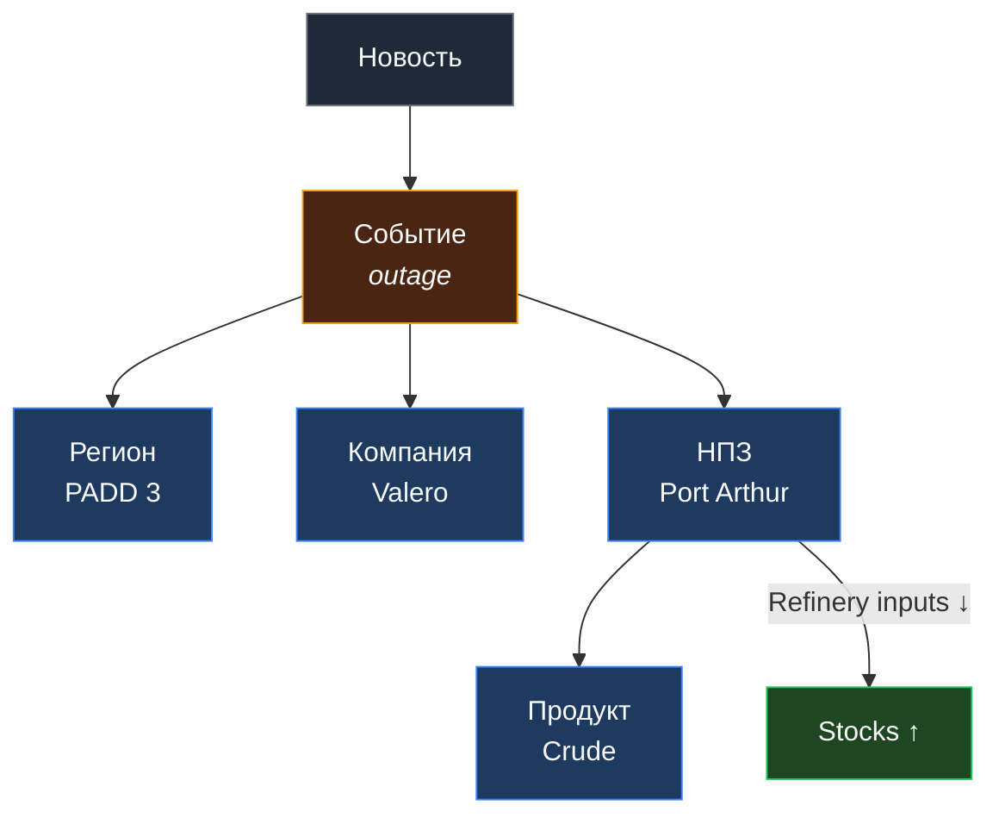
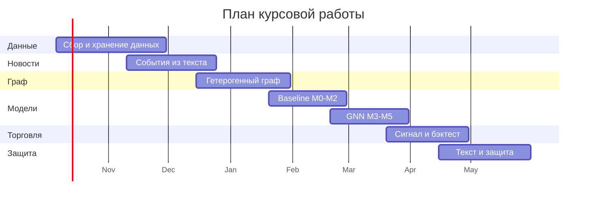

<h1 align="center">Новостной граф → прогноз нефтяного баланса</h1>

<p align="center">
  <i>Используем новости и структуру нефтяной инфраструктуры, чтобы прогнозировать<br>
  inventory surprise и торговать WTI calendar spread</i>
</p>

<p align="center">
  
  
  
  
</p>

---

## Итоговая тема

> **Прогнозирование неожиданного изменения запасов нефти (inventory surprise) на основе
> динамического гетерогенного графа новостных событий и его применение к торговле
> календарным спрэдом WTI.**

Главная логика работы: **мы не угадываем цену нефти напрямую.** Мы прогнозируем физический
дефицит или избыток, который меняет форму фьючерсной кривой.

Цена нефти включает макроэкономику, курс доллара, геополитику и общий risk appetite.
Календарный спрэд лучше изолирует эффект «нефть сейчас» против «нефти потом».

### Целевая переменная

```
Inventory Surpriseₜ = Actual ΔStocksₜ − Consensusₜ
Spread              = F_near − F_far
```

### Ключевой вопрос исследования

**Есть ли в новостном графе информация, которой ещё нет в ожиданиях аналитиков и в текущем
спрэде?** Основная проверка — дают ли GNN-признаки прирост качества сверх истории EIA,
консенсуса и текущей формы фьючерсной кривой.

---

## Состав команды

| Участник | GitHub | Зона ответственности |
|:--|:--|:--|
| Лященко Андрей | [@stirringrook](https://github.com/stirringrook) | _заполнить_ |
| Карих Дмитрий | [@papafranchesco](https://github.com/papafranchesco) | _заполнить_ |
| Андреев Иван | [@xenonblaq](https://github.com/xenonblaq) | _заполнить_ |
| Сергунцов Роман | [@serguntsov](https://github.com/serguntsov) | _заполнить_ |

## Куратор

| Куратор | GitHub |
|:--|:--|
| Гераськина Надежда | [@NGeraskina](https://github.com/NGeraskina) |

---

## Архитектура пайплайна


Экономическая цепочка: **новости о нефти → динамический граф → прогноз inventory surprise →
WTI calendar spread.**

---

## Источники данных

| | Блок | Источники | Что берём |
|:--|:--|:--|:--|
| **A** | Новости | Reuters, Bloomberg, GDELT | запросы: `oil`, `refinery`, `outage`, `OPEC`, `pipeline`, `Cushing`, `export`, `import` |
| **B** | Баланс нефти | EIA Weekly Petroleum Status Report | запасы, добыча, импорт, экспорт, загрузка НПЗ, Cushing, PADD |
| **C** | Консенсус | Investing, Trading Economics, Reuters polls, Bloomberg, Refinitiv | forecast перед публикацией EIA |
| **D** | Рынок | CME / NYMEX WTI futures | цены `F_near` и `F_far`, объём, open interest, сроки экспирации |

### Как вычленяем консенсус

1. Берём источники с полем `Forecast`: Investing, Trading Economics.
2. Если есть Bloomberg / Refinitiv — используем их `consensus`.
3. Для Reuters polls парсим текст: _«inventories likely fell by 1.3 million barrels»_.
4. Приводим к одному знаку: **draw — отрицательно**, **build — положительно**.
5. Сохраняем дату релиза и **время доступности** прогноза.

---

## Новости → события → гетерогенный граф

Мы не используем новости как «мешок текстов»: статья превращается в **событие**, а событие —
в часть нефтяной системы.

<table>
<tr><th>Шаг</th><th>Что делаем</th></tr>
<tr>
<td><b>1. Фильтрация</b></td>
<td>Дедупликация, язык, дата публикации. Убираем прямые утечки: API / EIA / аналитические прогнозы.</td>
</tr>
<tr>
<td><b>2. Классы событий</b></td>
<td><code>outage</code>, <code>maintenance</code>, <code>production_change</code>, <code>export/import_change</code>, <code>OPEC_decision</code>, <code>weather</code>, <code>pipeline_issue</code></td>
</tr>
<tr>
<td><b>3. Временной снимок</b></td>
<td>Для недели <code>t</code> строим граф <b>только из событий, известных до публикации отчёта EIA</b>.</td>
</tr>
</table>

### Пример извлечения структуры

> _«Valero temporarily shuts 300,000 bpd Port Arthur refinery for unplanned maintenance»_

`NER + Event extraction` →

| Поле | Значение |
|:--|:--|
| Компания | Valero |
| Объект | Port Arthur refinery |
| Регион | PADD 3 / Gulf Coast |
| Тип события | `outage` / `maintenance` |
| Мощность | 300 kb/d |
| Длительность | если указана в тексте |

### Схема графа



**Признаки для модели:** GNN-эмбеддинги узлов, число событий по типам и регионам,
«потерянная» мощность НПЗ, центральность событий, давность и вес источника.

---

## Дизайн проверки

Наращиваем информацию по одному блоку, чтобы увидеть вклад каждого.

| Модель | Входы |
|:--|:--|
| **M0** | история EIA |
| **M1** | `+ counts / sentiment` |
| **M2** | `+ text embeddings` |
| **M3** | `+ GNN embeddings` |
| **M4** | `+ consensus + curve` |
| **M5** | `+ GNN + consensus + API` |

**Входы полной модели:** история EIA (запасы, импорт, экспорт, добыча, НПЗ) · графовые
эмбеддинги `h_US`, `h_PADD3`, `h_Cushing` · консенсус рынка · текущий спрэд `F_near − F_far`.

### Метрики

| Группа | Показатели |
|:--|:--|
| Качество прогноза | MAE, RMSE для surprise, точность знака, корреляция с фактом |
| Торговое качество | PnL, Sharpe, max drawdown |

> **Разделение только по времени:** `train → validation → test`. Никакого случайного
> перемешивания — иначе получим утечку из будущего.

---

## Торговый сигнал

| Условие | Позиция |
|:--|:--|
| Ожидаем **draw** сильнее рынка | **Long** `F_near` + **Short** `F_far` |
| Ожидаем **build** сильнее рынка | **Short** `F_near` + **Long** `F_far` |

- **Backwardation:** `F_near > F_far` → спрэд положительный
- **Contango:** `F_near < F_far` → спрэд отрицательный

---

## План работы



<details>
<summary><b>Этап 1 · Данные и инфраструктура</b> — октябрь–ноябрь 2026</summary>

- Загрузка истории EIA Weekly Petroleum Status Report (запасы, добыча, импорт, экспорт, загрузка НПЗ, Cushing, PADD)
- Загрузка WTI futures: `F_near`, `F_far`, объём, open interest, календарь экспираций
- Сбор консенсус-прогнозов с фиксацией **времени доступности** каждого прогноза
- Сбор новостного корпуса по ключевым запросам
- Единая схема хранения и таймстемпы доступности для всех источников

**Готово, когда:** собран временной ряд `Inventory Surprise` за весь доступный период, и для
каждой недели известно, какие данные были доступны до публикации отчёта.
</details>

<details>
<summary><b>Этап 2 · Новости → события</b> — ноябрь–декабрь 2026</summary>

- Фильтрация: дедупликация, язык, дата публикации
- Удаление прямых утечек: API / EIA / аналитические прогнозы
- `NER + Event extraction`: компания, объект, регион, тип события, мощность, длительность
- Классификация по семи классам событий
- Ручная валидация выборки извлечённых событий

**Готово, когда:** на размеченной вручную выборке измерено качество извлечения событий и
подтверждено отсутствие утечек.
</details>

<details>
<summary><b>Этап 3 · Построение графа</b> — декабрь 2026 – январь 2027</summary>

- Схема гетерогенного графа: узлы `Новость`, `Событие`, `Регион`, `Компания`, `НПЗ`, `Продукт`
- Недельные временные снимки графа
- Расчёт признаков: «потерянная» мощность НПЗ, центральность событий, давность и вес источника
- Формальная **anti-leakage** проверка: в снимке недели `t` нет событий после релиза EIA

**Готово, когда:** автоматический тест подтверждает, что ни один снимок не содержит
информации из будущего.
</details>

<details>
<summary><b>Этап 4 · Baseline-модели M0–M2</b> — январь–февраль 2027</summary>

- `M0`: только история EIA
- `M1`: `+ counts / sentiment`
- `M2`: `+ text embeddings`
- Фиксация протокола разбиения `train → validation → test` только по времени

**Готово, когда:** MAE / RMSE и точность знака посчитаны для M0–M2 на одном и том же
временном разбиении.
</details>

<details>
<summary><b>Этап 5 · GNN и полные модели M3–M5</b> — февраль–март 2027</summary>

- `M3`: `+ GNN embeddings` (`h_US`, `h_PADD3`, `h_Cushing`)
- `M4`: `+ consensus + curve`
- `M5`: `+ GNN + consensus + API`
- Сравнение вклада каждого блока признаков

**Готово, когда:** измерено, даёт ли `M3` прирост над `M2`, и даёт ли `M5` прирост над `M4` —
то есть содержит ли граф информацию сверх консенсуса и формы кривой.
</details>

<details>
<summary><b>Этап 6 · Торговая часть и бэктест</b> — март–апрель 2027</summary>

- Правило перехода от прогноза к позиции на calendar spread
- Бэктест только по времени, с учётом издержек и сроков экспирации
- PnL, Sharpe, max drawdown

**Готово, когда:** есть кривая PnL на тестовом периоде и ответ, связан ли прогноз surprise с
фактическим изменением спрэда.
</details>

<details>
<summary><b>Этап 7 · Текст курсовой и защита</b> — апрель–май 2027</summary>

- Описание данных, методологии, результатов и ограничений
- Воспроизводимость: фиксация версий данных и кода
- Подготовка презентации и защита

**Готово, когда:** работа сдана и защищена.
</details>

---

## Ожидаемый вывод

> Если GNN улучшает прогноз inventory surprise, и этот прогноз связан с изменением спрэда,
> значит **новостной граф содержит применимую рыночную информацию.**

---

## Структура репозитория

```
.
├── data/            # сырые и обработанные данные (не коммитим)
├── notebooks/       # исследовательские ноутбуки
├── src/
│   ├── ingest/      # загрузка EIA, futures, консенсуса, новостей
│   ├── events/      # NER и извлечение событий
│   ├── graph/       # построение гетерогенного графа и снимков
│   ├── models/      # M0–M5
│   └── backtest/    # торговый сигнал и бэктест
├── reports/         # результаты, графики, текст работы
└── README.md
```
